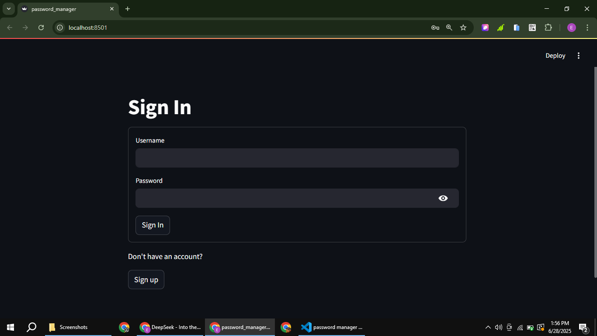
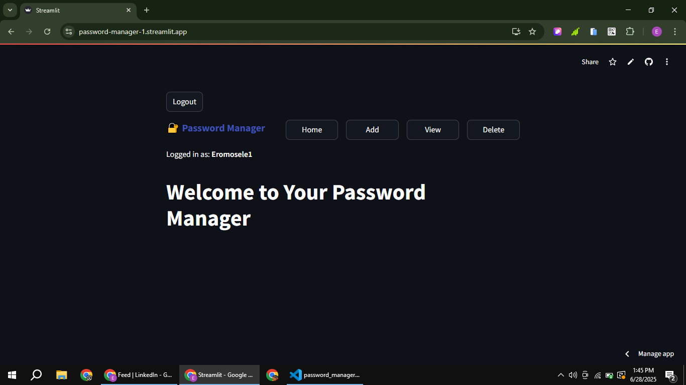

# 🔐 Python Password Manager

[](https://password-manager-1.streamlit.app/)
[](https://www.linkedin.com/posts/eromosele-itoya_%F0%9D%90%88%F0%9D%90%8D%F0%9D%90%93%F0%9D%90%91%F0%9D%90%8E%F0%9D%90%83%F0%9D%90%94%F0%9D%90%82%F0%9D%90%88%F0%9D%90%8D%F0%9D%90%86-%F0%9D%90%8C%F0%9D%90%98-%F0%9D%90%8E%F0%9D%90%8F%F0%9D%90%84%F0%9D%90%8D-%F0%9D%90%92%F0%9D%90%8E-activity-7344708425202692096-KY2B?utm_source=share&utm_medium=member_desktop&rcm=ACoAAEbDOGsBGINDr5uoWo3fkmNHZc_HI1Qst6k)

A secure password manager that protects your credentials with military-grade encryption.

## Features:
- User authentication system
- Fernet encryption
- scrypt password hashing
- SQLite database storage
- Simple web interface

## Screenshots 📸
| Sign In | Dashboard | Sign up View |
|---------|-----------|---------------|
|  |  |  |

## Installation ⚙️
1. Clone repository:
```bash
git clone https://github.com/youngdrizzy1/Password-Manager
cd password-manager
```

2. Install dependencies:
```bash
pip install -r requirements.txt
```

3. Run the app:
```bash
streamlit run app.py
```

## Security:
- All passwords encrypted with user-specific keys
- Salted hashing (scrypt algorithm)
- Master password required for decryption
- Database separation between users

## Live Demo 🌐
[Try the live app](https://password-manager-1.streamlit.app/)

## Connect with Me 👋
[LinkedIn](https://www.linkedin.com/in/eromosele-itoya/)
[GitHub](https://github.com/youngdrizzy1)
